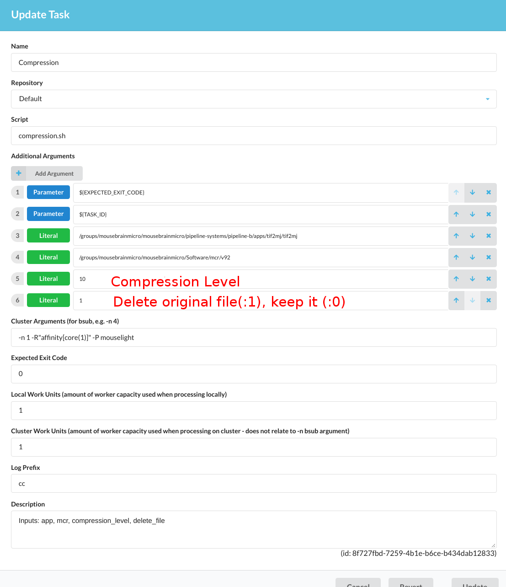

# compression
Converts tif to motion-jpeg-2000 (mj2) with a given compression rate. production version is compression/matlab/tif2mj.m 

## Arguments: 
* varargout = tif2mj(input_base,output_base,compression_lvl,delete_file,maxThreads)
* input_base: input folder where tif files reside
* output_base: mj2 output folder
* compression_lvl: factor of downsampling, e.g. 10(default) will result in 1/10 of the original file size
* delete_file: deletes the original file (default: '0')
* maxThreads: number of threads used for compression (default: '1'). use large number of threads(make sure it is less than actual cores) for faster conversion or use single thread ('1') for memory efficient cluster deployment.
### Sample Usage:
> tif2mj('./data/', './test/','5','0')

### Pipeline Usage:
There is a sample pipe named: "Compression Example", same logic as other pipes. Compression arguments can be passed in "Tasks":

<!--  -->

